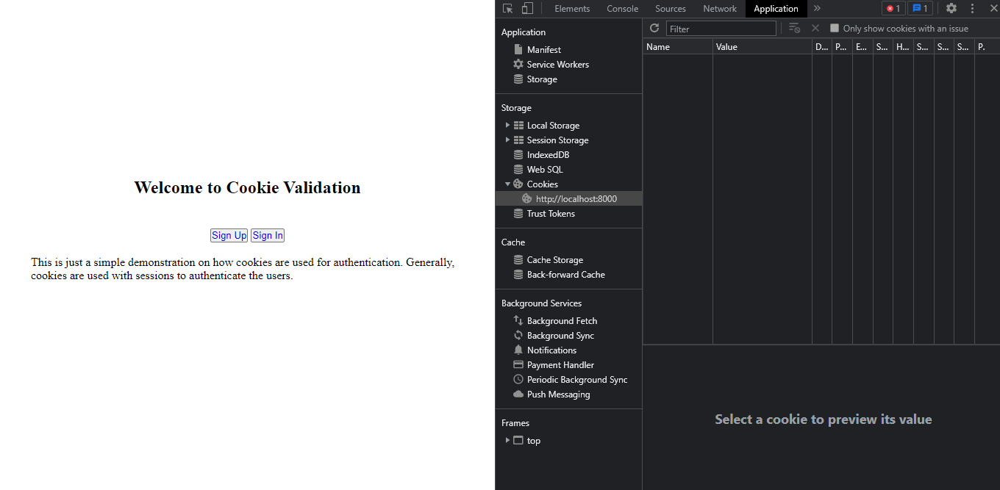
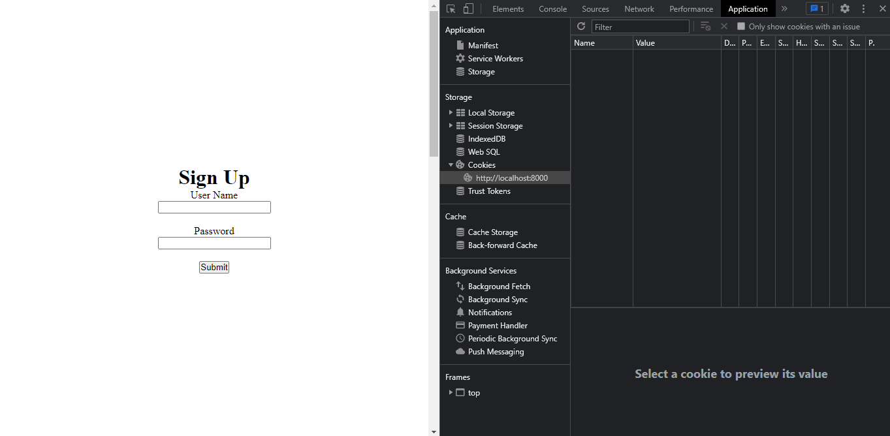
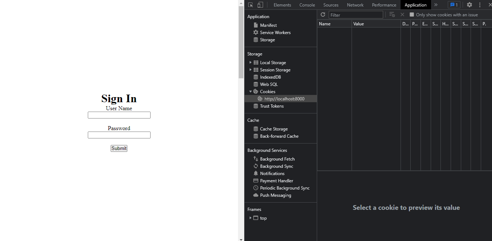

<h1>Cookie Validation</h1>

<h2>Site Flow</h2>


<h2>Main Page</h2>
<p>When a user opens the website, they will see the page on the left side. Notice, currently the browser dosen't have any cookie on it.</p>



<h2>Sign Up Page</h2>
<p>The user will go to sign up page, and they will register their account. This will store the data into the database.</p>



<h2>Sign In Page</h2>
<p>After that, the user will be redirected to the sign in page, and they will fill up their credentials. This will parse the database to check if the user exists, and if they exists, then add cookie and redirect the user to the home page.</p>



<h2>User's Home Page</h2>
<p>Now the users can access their secret pages. Also, they can close their home page tab and reopen it again without worrying about signing in again. However, this will only lasts till the cookie expires.</p>


<p>Note: This will clear the cookie after one minute and user's data after two minutes.
</p>

<br />

## Docker Image

<p>To try it on your own computer, pull the following docker image by typing the following command on your terminal:</p>

```cmd
docker pull meetnpatel/cookievalidator
```

<p>Few instructions for running the above docker image:</p>

- Port number must be the same for both host and container to run the website successfully.
-  Also, to run the website on a custom port an environment variable PORT will be required.

__Default:__
```cmd
docker run -it -p 8000:8000 meetnpatel/cookievalidator
```

__Custom Port:__

```cmd
docker run -it -p 7777:7777 -e PORT='7777' meetnpatel/cookievalidator
```

Website also contains detailed explaination for each function use to understand cookie validation.


